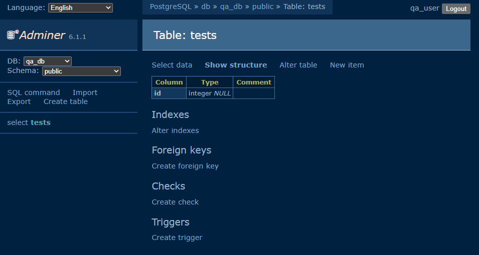

1. 

2. Cu flag-ul -v in comanda "docker compose down -v" stergi si datele din volume cand vrei sa opresti mediul, practic daca nu folosesti flag-ul -v la urmatoarea creare a mediului ai si datele din testele care au mai rulat.
Practic dupa "docker compose down -v" te asiguri ca la urmatoarea creare a mediului nu ai date vechi care iti poate corupe rezultatele